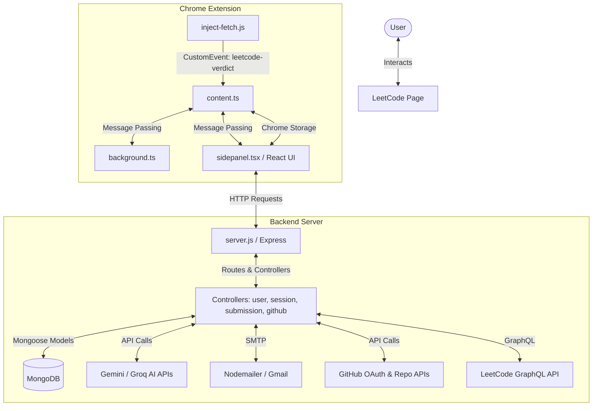

# Solvix  Master Project Documentation & Learning Guide

Welcome to the Master README for **Solvix** . This document serves as a comprehensive, technically rigorous, and beginner-friendly learning guide for the entire codebase. It is designed to allow any developer or AI agent to understand, run, debug, and extend this project from scratch.

---

## Table of Contents
1. [Project Overview](#1-project-overview)
2. [Complete Project Architecture](#2-complete-project-architecture)
3. [Complete Folder Structure](#3-complete-folder-structure)
4. [File-by-File Documentation](#4-file-by-file-documentation)
5. [Function-by-Function Documentation](#5-function-by-function-documentation)
6. [Complete User Flow](#6-complete-user-flow)
7. [Data Flow](#7-data-flow)
8. [Frontend Flow](#8-frontend-flow)
9. [Chrome Extension / Plasmo Flow](#9-chrome-extension--plasmo-flow)
10. [Backend Flow](#10-backend-flow)
11. [Database Flow](#11-database-flow)
12. [AI Flow](#12-ai-flow)
13. [Authentication & Security](#13-authentication--security)
14. [State Management](#14-state-management)
15. [Error Handling](#15-error-handling)
16. [Important Code Concepts](#16-important-code-concepts)
17. [Complete Request/Response Flows](#17-complete-requestresponse-flows)
18. [Component Relationship Map](#18-component-relationship-map)
19. [Dependency Map](#19-dependency-map)
20. [Configuration Files](#20-configuration-files)
21. [Build and Run Flow](#21-build-and-run-flow)
22. [Master Flow Connection Map](#22-how-the-entire-project-connects)
23. [Beginner Q&A Walkthrough](#23-beginner-explanation)
24. [Debugging Guide](#24-debugging-guide)
25. ["If I Change This File..." Impact Guide](#25-if-i-change-this-file-guide)
26. [Important Flows Cheat Sheet](#26-important-flows-cheat-sheet)
27. [Complete File Index](#27-complete-file-index)
28. [Important Functions Index](#28-important-functions-index)
29. [Important Components Index](#29-important-components-index)
30. [Final Learning Roadmap](#30-final-learn-this-project-roadmap)

---

## 1. Project Overview

### What is Solvix ?
**Solvix** is an AI-powered coding assistant and practice tracker designed specifically for LeetCode. It exists to solve the fragmentation problem in competitive programming prep: developers typically have to jump between LeetCode (solving problems), Excel or Notion (tracking lists like Blind 75/NeetCode 150), external explanation resources (YouTube/GeeksforGeeks), separate code repos (for pushing solutions to GitHub), and ChatGPT (for debugging or explanations).

Solvix consolidates all of these resources directly into a Chrome Extension side panel and popup overlay, linked to a custom Node.js/Express backend, MongoDB database, and LLMs (Google Gemini/Groq).

### Main Features
- **Integrated Practice Sheets**: Built-in support for popular sheets like Blind 75, NeetCode 150, Love Babbar 450, Striver SDE, and Striver A2Z.
- **AI Workspace**: An interactive chat interface that leverages Gemini/Groq. It can explain problems, give incremental hints, optimize code, find bugs, and generate full solutions.
- **Similar Questions & Premium Alternatives**: Scrapes the page to check if the current problem is a LeetCode Premium problem. If locked (or even if free), it dynamically suggests equivalent problems on GeeksforGeeks, Codeforces, HackerRank, and CodeChef.
- **Automated Submission Interception**: Captures code submissions in real-time by hooking into the browser's `fetch` and `XHR` APIs. 
- **GitHub DSA Sync**: Automatically commits and pushes accepted solutions to the user's personal GitHub repository (under a repository named `DSA`).
- **Activity & Productivity Analytics**: Tracks streaks, average time taken, topic coverage, language distribution, and consistency. Uses this to calculate an **Interview Readiness Score** and provide customized recommendations.
- **Scheduled Progress Digests**: Automatically sends Daily, Weekly, and Monthly reports containing performance charts (powered by QuickChart.io) and topic breakdown summaries to the user's email.

### Technology Stack
- **Extension**: Plasmo framework (React, TypeScript, Tailwind CSS, Monaco Editor/DOM hooks).
- **Backend**: Node.js, Express, Mongoose.
- **Database**: MongoDB (Atlas or local).
- **AI Integration**: Google Gemini API & Groq API.
- **Email Service**: Nodemailer (via SMTP/Gmail), node-cron (schedules daily/weekly/monthly reports).

---

## 2. Complete Project Architecture

The overall flow begins when a user loads a LeetCode problem. The injected script captures page requests and dispatches custom DOM events. The content script handles DOM reading and mounts custom overlay UI elements. The side panel displays a dashboard synced with a Node.js/Express server and MongoDB database.



### Detailed Flow Steps
1. **Interception**: `inject-fetch.js` runs directly in the page context. It overrides `window.fetch` and `XMLHttpRequest.prototype.open` to listen for requests containing `/submit`, `/interpret_solution`, or `/check`. When a response is received, it extracts the submission status (e.g., `"Accepted"`) and dispatches a custom `leetcode-verdict` DOM event.
2. **Scraping & Messaging**: `content.ts` (the content script running in an isolated world) listens for the `leetcode-verdict` event, extracts the problem details (difficulty, language, title, slug, and code), and forwards them using `chrome.runtime.sendMessage`. It also mounts a floating `🤖 AI Help` button next to the standard LeetCode "Save" buttons.
3. **React Side Panel UI**: `sidepanel.tsx` runs inside the Chrome Side Panel. It receives messages from the content script, tracks elapsed time, manages the active practice sheets, and handles login. It displays tabs for the Dashboard, Profile, Stats, Practice, and AI.
4. **Backend Route Processing**: The Express server hosts API routes. It validates requests, processes metrics (e.g., classifying topic categories and Big-O complexities using AI), stores records in MongoDB, and triggers GitHub pushes or reports.

---

## 3. Complete Folder Structure

Below is the layout of the project workspace:

```text
Solvix/
├── Backend/
│   ├── controllers/
│   │   ├── onboardingController.js   # Handles onboarding preferences and stats updating
│   │   ├── sessionController.js      # CRUD operations for custom practice sessions
│   │   ├── submissionController.js   # Saves submissions, fetches statistics, handles heatmap aggregation
│   │   └── userController.js         # Syncs LeetCode profiles and manages daily report settings
│   ├── models/
│   │   ├── Session.js                # Schema representing a practice session (questions, verdict, time)
│   │   ├── Submission.js             # Schema representing a code submission (complexity, topics, code)
│   │   └── User.js                   # Schema representing a user profile, preferences, streak, and GitHub tokens
│   ├── routes/
│   │   ├── githubRoutes.js           # GitHub OAuth authentication, repo binding, and solution pushing
│   │   ├── leetcodeRoutes.js         # Proxies GraphQL queries directly to LeetCode API
│   │   ├── onboardingRoute.js        # Onboarding preferences API bindings
│   │   ├── sessionRoutes.js          # Practice sessions API bindings
│   │   ├── submissionRoutes.js       # User submissions API bindings
│   │   └── userRoutes.js             # User profiles API bindings
│   ├── services/
│   │   ├── dailyReportScheduler.js   # Calculates daily performance metrics and schedules report emails
│   │   ├── emailService.js           # Builds email templates, generates charts (QuickChart.io), and sends mail
│   │   ├── githubService.js          # Interacts with GitHub API to manage repos, branches, and commits
│   │   ├── leetcodeAPI.js            # GraphQL client fetching stats from LeetCode
│   │   ├── monthlyDigestScheduler.js # Calculates monthly performance metrics and schedules email reports
│   │   └── reminderScheduler.js      # Checks streaks and sends practice reminders
│   ├── utils/
│   │   └── emailTemplates.js         # HTML layouts for email messages
│   ├── .env                          # Backend environment configurations
│   ├── server.js                     # Express backend entry point; runs AI completions and schedulers
│   └── testConnection.js             # Script to verify database connectivity
└── track-it/
    ├── assets/                       # Static logo images and icons
    ├── components/
    │   ├── AITab/
    │   │   ├── components/
    │   │   │   ├── ChatInput.tsx     # Message input box with Stop and Quick action pills
    │   │   │   ├── ChatMessage.tsx   # Displays messages using markdown renderers
    │   │   │   ├── ChatWindow.tsx    # Renders message bubbles or the Welcome screen
    │   │   │   ├── CodeBlock.tsx     # Code viewer with syntax highlighting and copy functions
    │   │   │   ├── ContextBar.tsx    # Header displaying active problem name, language, and refresh options
    │   │   │   └── WelcomeScreen.tsx # Screen showing setup status and prompt suggestions
    │   │   └── AITab.tsx             # Main container for the AI assistant tab
    │   │   
    │   ├── Dashboard/
    │   │   ├── AdvancedStats.tsx     # Renders active days, average attempts, and consistency
    │   │   ├── DailyGoalRing.tsx     # Visual ring representation of progress towards the daily goal
    │   │   ├── DailyPerformanceCard.tsx # Compares today's results with yesterday's
    │   │   ├── DashboardWidgets.tsx  # Layout container for dashboard widgets
    │   │   ├── ProductivityDashboard.tsx # Renders streaks, focus topics, and insights on the dashboard
    │   │   ├── QuickActionsBar.tsx   # Navigational shortcuts for the user
    │   │   ├── TodaysFocusCard.tsx   # Highlights weak topics and recommended sheets
    │   │   └── WeeklyProgressSummary.tsx # Renders a 7-day progress bar chart
    │   │   
    │   ├── Sessions/
    │   │   ├── DifficultyBreakdown.tsx # Renders problems solved grouped by difficulty
    │   │   ├── PracticeSessions.tsx  # Manages custom practice sheets and questions list
    │   │   ├── SessionHistory.tsx    # Renders historical sessions data
    │   │   ├── SheetDashboard.tsx    # Displays category-level details of chosen sheets
    │   │   └── SheetSelector.tsx     # Dropdown menu to switch sheets
    │   │   
    │   ├── Stats/
    │   │   ├── DifficultyAnalytics.tsx # Computes solve distributions and time taken
    │   │   ├── InterviewReadiness.tsx  # Calculates interview readiness percentages
    │   │   ├── PracticeInsights.tsx  # Dynamic performance hints
    │   │   ├── Recommendations.tsx   # Recommended topics to practice next
    │   │   ├── TopicAnalytics.tsx    # Mastery stats grouped by topic
    │   │   └── WeakTopicRadar.tsx    # Identifies weak areas based on time spent and failures
    │   │   
    │   ├── CelebrationOverlay.tsx    # Overlay displayed when a problem is solved
    │   ├── HelpButton.tsx            # Floating action menu injected into the LeetCode UI
    │   ├── LeetCodeLogin.tsx         # Welcome screen for unauthenticated users
    │   └── MarkdownRenderer.tsx      # Renders rich text inside the popup
    │   
    ├── constants/
    │   ├── aiPrompts.ts              # Preset prompt templates (hints, optimizations, explanations)
    │   └── api.ts                    # Backend server URI exports
    ├── data/
    │   ├── sheets/
    │   │   ├── blind75.ts            # Curated Blind 75 questions list
    │   │   ├── neetcode150.ts        # Curated NeetCode 150 questions list
    │   │   ├── striverSde.ts         # Striver SDE questions list
    │   │   └── index.ts              # Exports sheet items and difficulty indexes
    │   └── premiumAlternatives.ts    # Mappings of premium problems to free platform alternatives
    ├── hooks/
    │   └── useLeetCodeUser.ts        # Coordinates LeetCode API authentication checks
    ├── utils/
    │   ├── analytics.ts              # Contains calculations for streaks and readiness
    │   ├── storage.ts                # Interacts with chrome.storage.local
    │   └── navigation.ts             # Controls page redirections
    ├── background.ts                 # Service worker managing tabs and opening the side panel
    ├── content.ts                    # Content script scraping questions and injecting scripts
    ├── inject-fetch.js               # Injected script intercepting fetch/XHR requests
    ├── sidepanel.tsx                 # Main layout representing the Chrome Sidepanel UI
    └── tailwind.config.js            # Tailwind layout styling configurations
```

---

## 4. File-by-File Documentation

### `track-it/inject-fetch.js`
- **Purpose**: Runs inside the LeetCode page context to intercept HTTP requests.
- **Used by**: Injected into the document header by `content.ts`.
- **Imports**: None.
- **Exports**: None.
- **Flow**: Overrides `window.fetch` and `XMLHttpRequest.prototype.open`. When it catches an outgoing request containing `/submit`, it increments `attempts`. Once the response arrives from LeetCode, it reads `status_msg`. If it is `"Accepted"`, it flags it. It then dispatches a CustomEvent named `leetcode-verdict` to the DOM.

### `track-it/content.ts`
- **Purpose**: Connects the LeetCode page DOM to the Chrome Extension.
- **Used by**: Executed automatically on matching pages (`https://leetcode.com/*`).
- **Imports**: `PlasmoCSConfig`, `mountHelpButton`.
- **Exports**: `config` matching configuration rules.
- **Flow**: Inserts `inject-fetch.js` into the DOM. It listens for DOM changes via a `MutationObserver` to extract the problem title, slug, and description. It dispatches messages to the background worker (`QUESTION_INFO`). It also listens for `APPLY_CODE` messages to insert generated solutions back into the Monaco editor or text area.

### `track-it/background.ts`
- **Purpose**: Background service worker acting as an event broker.
- **Used by**: Configured as the extension service worker in `manifest`.
- **Imports**: Chrome extension typing headers.
- **Exports**: None.
- **Flow**: Listens for runtime messages. 
  - `NAVIGATE`: Directs the active tab to a new URL.
  - `APPLY_CODE`: Forwards the code to `content.ts` to be written into the editor.
  - `OPEN_AI_TAB`: Launches the extension side panel via `chrome.sidePanel.open` using the tab's `windowId`.

### `track-it/sidepanel.tsx`
- **Purpose**: Root component of the extension side panel.
- **Used by**: Rendered when the extension side panel opens.
- **Imports**: React hooks, `LeetCodeLogin`, `AITab`, `PracticeSessions`, `StatsTab`, `ProductivityDashboard`, `chrome.storage` utils, sheets, and analytics helper functions.
- **Exports**: `IndexSidePanel` default component.
- **Flow**: On mount, checks if the user is logged into LeetCode. If not, it redirects the user to the login screen. It displays the side panel navigation tabs, reads current question changes from `content.ts`, updates the timer, saves submission records to MongoDB on success, and pushes solutions to GitHub if configured.

### `Backend/server.js`
- **Purpose**: Main entry point of the Node.js/Express backend application.
- **Used by**: Executed when starting the backend.
- **Imports**: Express, Mongoose, CORS, Route handlers, and scheduler files.
- **Exports**: None.
- **Flow**: Establishes a connection to MongoDB. Mounts route handlers (`/api/sessions`, `/api/users`, `/api/submissions`, `/api/github`). Registers background cron schedulers. Sets up direct AI completions APIs (`/api/ask-ai`, `/api/ai-assistant`, `/api/analyze-algorithm`, `/api/analyze-complexity`).

---

## 5. Function-by-Function Documentation

### `callAI(prompt)`
- **File**: [`Backend/server.js`](file:///c:/Users/manga/Solvix/Backend/server.js#L60-L130)
- **Called by**: Express POST endpoints (`/api/ask-ai` and `/api/ai-assistant`).
- **Arguments**: `prompt` string.
- **Details**: Checks the `AI_PROVIDER` environment variable. If set to `"groq"`, it sends the prompt to the Groq Chat Completions endpoint. If configured as `"gemini"` (default), it makes a POST request to the Gemini API endpoint. It extracts the generated text response and returns it.

### `setQuestionVerdict(req, res)`
- **File**: [`Backend/controllers/sessionController.js`](file:///c:/Users/manga/Solvix/Backend/controllers/sessionController.js#L6-L31)
- **Called by**: Route endpoint (`PUT /api/sessions/:sessionId/questions/:questionId/verdict`).
- **Arguments**: `req` (containing parameters and body details) and `res`.
- **Details**: Locates the session by ID. If found, it updates the question sub-document's execution status. If the verdict is `"Accepted"`, it sets `completed` to `true` and saves the updated session to the database.

### `exchangeCodeForToken(code, clientId, ...)`
- **File**: [`Backend/services/githubService.js`](file:///c:/Users/manga/Solvix/Backend/services/githubService.js#L12-L36)
- **Called by**: Route endpoint (`POST /api/github/exchange`).
- **Arguments**: OAuth authentication code, client ID, client secret, and redirect URI.
- **Details**: Sends a request to `https://github.com/login/oauth/access_token`. If successful, it parses the JSON response and returns the `access_token`.

### `sendReminderEmail(user)`
- **File**: [`Backend/services/reminderScheduler.js`](file:///c:/Users/manga/Solvix/Backend/services/reminderScheduler.js#L164-L208)
- **Called by**: `checkAndSendReminders()`.
- **Arguments**: User mongoose model object.
- **Details**: Checks if the user has enabled practice reminders. It generates a personalized email template containing their current streak and focus topics. It then sends the email using Nodemailer.

---

## 6. Complete User Flow

The typical journey of a user practicing on LeetCode:

```text
User opens LeetCode page
   ↓
"inject-fetch.js" hooks fetch/XHR
   ↓
"content.ts" extracts Title, Slug, & Description
   ↓
Message sent to Side Panel ("QUESTION_INFO")
   ↓
Side panel starts the Timer and checks for alternatives if Premium
   ↓
User clicks "🤖 AI Help" on LeetCode or clicks "Explain" in Side Panel
   ↓
Side panel forwards context to backend AI endpoint
   ↓
Backend queries Gemini/Groq and returns Markdown response
   ↓
User solves problem and clicks LeetCode "Submit"
   ↓
"inject-fetch.js" captures "Accepted" HTTP response
   ↓
Verdict CustomEvent dispatched to "content.ts"
   ↓
"content.ts" sends "VERDICT" message to Side Panel
   ↓
Side panel triggers background tasks:
  1. POST /api/submissions (DB save, checks topics/complexity via AI)
  2. POST /api/github/push-solution (syncs to GitHub repo)
   ↓
Side panel opens Celebration Overlay and stops Timer
```

---

## 7. Data Flow

This chart shows how a user's code submission flows through the system to update analytics and GitHub:

```text
[LeetCode Monaco Editor]
       ↓ (content.ts: extracts code & language)
[Runtime Message payload]
       ↓ (sidepanel.tsx: catches VERDICT event, fetches AI classifications)
[POST /api/submissions]
       ↓ (submissionController.js: writes to MongoDB)
[Submission Model Document]
       ↓ (sessionController.js / dailyReportScheduler.js)
[Nodemailer / HTML Reports]
```

- **Problem Details**: Extracted from the DOM by `content.ts` and sent to the extension side panel.
- **Submissions**: Saved to MongoDB with complexity metrics generated by AI.
- **GitHub Sync**: Outgoing commits are created via the GitHub API and pushed to the user's `DSA` repository.

---

## 8. Frontend Flow

### React Component Hierarchy

```text
IndexSidePanel (sidepanel.tsx)
  ├─ LeetCodeLogin
  ├─ CelebrationOverlay
  ├─ ProductivityDashboard
  │    ├─ DailyGoalRing
  │    ├─ TodaysFocusCard
  │    ├─ WeeklyProgressSummary
  │    └─ AdvancedStats
  ├─ PracticeSessions
  │    ├─ SheetSelector
  │    ├─ SheetDashboard
  │    └─ SessionHistory
  ├─ StatsTab
  │    ├─ DifficultyAnalytics
  │    ├─ TopicAnalytics
  │    └─ WeakTopicRadar
  └─ AITab
       ├─ ContextBar
       ├─ ChatWindow
       │    └─ ChatMessage
       │         └─ CodeBlock
       └─ ChatInput
```

### State Management & Effects
- **Problem Context Syncing**: `sidepanel.tsx` coordinates state updates across tabs.
- **Storage Subscriptions**: Uses `onChromeStorageKeyChanged` to keep the user's daily goals in sync between the dashboard and profile tabs.
- **AI Workspace Persistence**: Chat histories are loaded from chrome local storage on mount using a key based on the problem's slug.

---

## 9. Chrome Extension / Plasmo Flow

### Manifest Permissions
- `scripting`: Required to inject scripts into the LeetCode page context.
- `activeTab`: Used to access the current browser tab.
- `storage`: Enables caching user profiles and chat histories.
- `identity`: Launches OAuth flows to connect with GitHub.

### Message Passing API Reference

| Message Type | Source | Destination | Payload | Purpose |
|---|---|---|---|---|
| `QUESTION_INFO` | `content.ts` | `sidepanel.tsx` | `{title, isPremium, slug}` | Notifies the side panel when a new problem is opened. |
| `VERDICT` | `content.ts` | `sidepanel.tsx` | `{source, verdict, attempts, code, language}` | Notifies the side panel when a submission is processed. |
| `GET_CONTEXT` | `sidepanel.tsx` | `content.ts` | None | Fetches the current problem description, code, and language. |
| `APPLY_CODE` | `sidepanel.tsx` | `content.ts` | `{code}` | Writes code generated by AI back into the LeetCode editor. |
| `OPEN_AI_TAB` | `background.ts` | `sidepanel.tsx` | `{description, code}` | Opens the side panel and switches to the AI workspace. |

---

## 10. Backend Flow

### API Routing Specifications

#### Users
- `POST /api/users/create-or-get`: Retrieves or creates a user profile.
- `GET /api/users/onboarding/:username`: Gets onboarding preferences.
- `POST /api/users/onboarding/:username`: Saves onboarding preferences.
- `GET /api/users/daily-report-settings/:username`: Retrieves daily email report settings.
- `POST /api/users/daily-report-settings/:username`: Updates daily email report settings.

#### Practice Sessions
- `POST /api/sessions`: Creates a new practice session.
- `GET /api/sessions/user/:username`: Gets all sessions for a user.
- `GET /api/sessions/:sessionId`: Fetches details for a specific session.
- `PUT /api/sessions/:sessionId/start`: Starts the session timer.
- `PUT /api/sessions/:sessionId/finish`: Marks a session as finished and sends a summary email.
- `PUT /api/sessions/:sessionId/questions/:questionId/complete`: Marks a question as completed.
- `PUT /api/sessions/:sessionId/questions/:questionId/verdict`: Saves a question's execution verdict.

#### Submissions
- `POST /api/submissions`: Saves a new submission.
- `GET /api/submissions/user/:username`: Gets all submissions for a user.
- `GET /api/submissions/stats/:username`: Computes statistics for dashboard widgets.
- `GET /api/submissions/heatmap/:username`: Fetches user activity heatmap data.

#### GitHub Integration
- `GET /api/github/auth-url`: Generates a GitHub OAuth authorization link.
- `POST /api/github/exchange`: Exchanges a code for a GitHub access token.
- `POST /api/github/connect`: Saves connection details for a user's GitHub account.
- `POST /api/github/ensure-dsa-repo`: Creates a `DSA` repository if it does not exist.
- `POST /api/github/push-solution`: Commits and pushes a solution file to GitHub.

---

## 11. Database Flow

The database uses MongoDB managed via Mongoose.

```text
[Frontend React UI]
       ↓ (REST HTTP Requests)
[Express Controllers]
       ↓ (Mongoose Queries)
[MongoDB Atlas collections: users, sessions, submissions]
```

### Models & Schema Layouts

#### User (`models/User.js`)
- `username`: String (Required, Unique index)
- `avatar`: String
- `ranking`: Number
- `email`: String
- `timezone`: String (Default: `"UTC"`)
- `preferences`:
  - Reminders: `{enabled, time, frequency}`
  - Notifications: `{sessionSummary, weeklyReport, milestones}`
  - Goals: `{dailyQuestions, focusTopics}`
- `github`: `{connected, accessToken, username, repo, branch}`
- `streak`: `{current, longest, lastActivityDate}`

#### Submission (`models/Submission.js`)
- `username`: String (Required, Index)
- `questionName`: String (Required)
- `attempts`: Number
- `timeSpent`: Number
- `topics`: [String]
- `difficulty`: String
- `verdict`: String
- `language`: String
- `timeComplexity`: String
- `spaceComplexity`: String
- `code`: String
- `submittedAt`: Date

---

## 12. AI Flow

The AI integration supports code generation and assistance using structured system prompts:

```text
[User Chat Request]
       ↓
[Assemble context: Problem Description + Current Code + Conversation History]
       ↓
[Append Prompt Template: DPROMPT (code generation) or ASSISTANT_PROMPT (mentor)]
       ↓
[Post request to Gemini / Groq APIs]
       ↓
[Parse response and return Markdown content to the UI]
```

- **DPROMPT**: System instructions for code completions. Instructs the model to return *only* the completed code in a Markdown code block with no explanations.
- **ASSISTANT_PROMPT**: System instructions for the mentor chat. Instructs the model to explain algorithms, provide hints, or find bugs *without* writing code for the user.

---

## 13. Authentication & Security

- **LeetCode Authentication**: The extension requests details from LeetCode endpoints (`https://leetcode.com/api/problems/algorithms/`) using `credentials: "include"`. This sends the user's active session cookies to authenticate them without requesting passwords.
- **GitHub Connection**: Handled via OAuth 2.0. The extension uses `chrome.identity.launchWebAuthFlow` to open the authorization window. The backend exchanges the authorization code for an access token, which is stored in MongoDB.
- **CORS Protection**: The Express backend uses `cors()` middleware to restrict cross-origin request access to authorized clients.

---

## 14. State Management

Key application states managed in the frontend:

| State Variable | Scope | Primary Mutator | UI Dependencies |
|---|---|---|---|
| `leetcodeUser` | Global hook (`useLeetCodeUser`) | `fetchLeetCodeUser` / `logout` | Profile cards, dashboards, login status. |
| `activeTab` | Root side panel (`sidepanel.tsx`) | Navigation click handlers | Content render switches. |
| `messages` | Chat tab (`AITab.tsx`) | `handleSend` / `handleClear` | Chat bubble window, input placeholders. |
| `elapsed` | Active timer (`sidepanel.tsx`) | `setInterval` timer tick | Time spent displays on dashboard. |
| `dailyGoal` | Custom storage sync | Chrome Storage onChanged listener | Productivity progress ring. |

---

## 15. Error Handling

- **AI API Errors**: If an AI request fails, the application returns a user-friendly error message (`❌ Sorry, I encountered an error. Please check your connection and try again.`).
- **Silent Failures for Optional Features**: If a GitHub push or summary email fails (e.g. because email is not configured), the application logs the error in the console but does not block the user from saving their submission.
- **Extension Context Invalidation**: When the extension updates in the background, active tabs may throw context errors. The application catches these errors (`Extension context invalidated`) to prevent console spam.

---

## 16. Important Code Concepts

- **Fetch Interceptions**: Overrides native prototypes to capture HTTP requests without affecting LeetCode's performance.
- **DOM Mutation Observing**: Observes DOM updates to detect when the user switches to a different problem.
- **Monaco Editor Integration**: Interacts with Monaco Editor APIs (`window.monaco.editor`) to write code directly into the editor when the user accepts an AI solution.
- **SMTP Connection Pooling**: Uses connection pools in Nodemailer (`pool: true`) to queue and send progress reports efficiently.

---

## 17. Complete Request/Response Flows

### Submission Interception and GitHub Sync

```text
User clicks LeetCode "Submit"
   ↓
Browser fetch POST /submit is triggered
   ↓
"inject-fetch.js" captures request, increments attempts
   ↓
Response received from LeetCode
   ↓
CustomEvent "leetcode-verdict" dispatched to DOM
   ↓
"content.ts" listener catches CustomEvent
   ↓
Content script sends VERDICT message to Side Panel
   ↓
Side Panel POSTs submission to /api/submissions
   ↓
Backend runs AI analysis to categorize topics and complexity
   ↓
Backend writes record to MongoDB
   ↓
If verdict is "Accepted" and GitHub is connected:
   ↓
Side Panel POSTs solution to /api/github/push-solution
   ↓
Backend pushes the solution code to the user's "DSA" repo on GitHub
```

---

## 18. Component Relationship Map

Below is a map of key props and callback relationships:

```text
IndexSidePanel (sidepanel.tsx)
  ├── LeetCodeLogin
  │     └── onLogin={openLeetCodeLogin} (handles user redirect)
  │
  ├── ProductivityDashboard
  │     ├── username={leetcodeUser.username}
  │     └── onNavigateTab={(tab) => setActiveTab(tab)}
  │
  └── AITab
        ├── description={aiContext.description}
        ├── code={aiContext.code}
        └── slug={currentProblemSlug}
```

---

## 19. Dependency Map

### Backend Dependencies
- **express**: App server framework.
- **mongoose**: MongoDB schema design and validation framework.
- **nodemailer**: Email transporter client.
- **node-cron**: Triggers scheduled cron tasks.
- **node-fetch**: Fallback HTTP client.
- **dotenv**: Environment variable parser.

### Frontend Dependencies
- **plasmo**: Chrome extension developer compiler.
- **react** & **react-dom**: UI view engine.
- **lucide-react**: Vector UI icon assets.
- **react-syntax-highlighter**: Highlights code blocks in responses.
- **tailwindcss**: Styling framework.

---

## 20. Configuration Files

- **`track-it/package.json`**: Defines dependencies, build commands, and permissions (`scripting`, `activeTab`, `storage`, `identity`).
- **`track-it/tailwind.config.js`**: Custom Tailwind layout configurations.
- **`track-it/tsconfig.json`**: TypeScript compiler rules.
- **`Backend/.env`**: Server configuration file containing credentials:
  - `PORT`: Port to listen on.
  - `MONGO_URI`: MongoDB connection string.
  - `GEMINI_API_KEY`: API key for Gemini.
  - `GROQ_API_KEY`: API key for Groq.
  - `EMAIL_USER` & `EMAIL_PASS`: SMTP email credentials.
  - `GITHUB_CLIENT_ID` & `GITHUB_CLIENT_SECRET`: GitHub App credentials.

---

## 21. Build and Run Flow

### Backend Development Setup
1. Open the `/Backend` directory.
2. Create a `.env` file and populate it with your database and API keys.
3. Install dependencies:
   ```bash
   npm install
   ```
4. Run the development server:
   ```bash
   npm run dev
   ```

### Chrome Extension Setup
1. Open the `/track-it` directory.
2. Install dependencies:
   ```bash
   npm install
   ```
3. Start the Plasmo development server:
   ```bash
   npm run dev
   ```
4. Open Google Chrome and navigate to `chrome://extensions/`.
5. Enable **Developer mode** (toggle in top right).
6. Click **Load unpacked** and select the `/track-it/build/chrome-mv3-dev` directory.

---

## 22. How the Entire Project Connects

```text
                            ┌──────────────┐
                            │    User      │
                            └──────┬───────┘
                                   │ Interacts
                                   ▼
                            ┌──────────────┐
                            │   LeetCode   │
                            └──────┬───────┘
                                   │ Intercepted by inject-fetch.js
                                   ▼
                            ┌──────────────┐
                            │  content.ts  │
                            └──────┬───────┘
                                   │ Message Passing
                                   ▼
                            ┌──────────────┐
                            │ sidepanel.tsx│
                            └──────┬───────┘
                                   │ HTTP Requests
                                   ▼
                            ┌──────────────┐
                            │  Express API │
                            └──────┬───────┘
                                   │ Handles business logic
                                   ▼
                         ┌─────────┴─────────┐
                         ▼                   ▼
                  ┌─────────────┐     ┌─────────────┐
                  │   MongoDB   │     │  AI Engine  │
                  └─────────────┘     └─────────────┘
```

---

## 23. Beginner Explanation

### Q: What happens when I open LeetCode?
**A**: The extension's content script (`content.ts`) runs on the page. It injects `inject-fetch.js` to listen for submissions and mounts the floating `🤖 AI Help` button on the LeetCode interface.

### Q: What happens when I select a problem?
**A**: The content script extracts the problem title, description, slug, and programming language, and sends them to the side panel. The side panel resets the timer and updates its state with the active problem's details.

### Q: What happens when I click "Give me a Hint"?
**A**: The application sends the problem description and your code to the backend. The backend queries the AI model using the `ASSISTANT_PROMPT` system template to generate incremental hints without showing the final code.

### Q: What happens when I click "Full Solution"?
**A**: The application queries the AI model using the `DPROMPT` system template to generate the complete solution. Once returned, you can click "Insert Code" to paste it directly into the LeetCode editor.

### Q: What happens when the AI responds?
**A**: The side panel updates the chat history in the local state and saves it to chrome local storage under a key named after the problem's slug.

---

## 24. Debugging Guide

### Out of Memory or Port Conflicts
- **Issue**: Backend fails to start.
- **Solution**: Ensure port `4000` is free. You can configure a different port in the `.env` file (`PORT=5000`).

### AI Responses Not Appearing
- **Issue**: Chat interface displays thinking indicators forever.
- **Checklist**:
  1. Open the browser dev tools console inside the Chrome side panel.
  2. Inspect the network requests to check the status of POST `/api/ai-assistant`.
  3. Verify that your backend server is running and your `GEMINI_API_KEY` or `GROQ_API_KEY` is configured correctly.

---

## 25. "If I Change This File..." Guide

### Changing `inject-fetch.js`
- **Impact**: Affects how the extension intercepts LeetCode submissions.
- **Watch out**: Any changes to the JSON response paths must match the actual LeetCode API responses, otherwise submissions will not be detected. You must reload the extension in `chrome://extensions/` and refresh your LeetCode tabs to apply changes.

### Changing `sidepanel.tsx`
- **Impact**: Affects the main extension UI.
- **Watch out**: Changes to navigation tabs, themes, or layouts will update the interface immediately if using hot reloading.

### Changing `models/Submission.js`
- **Impact**: Modifies the database schema for submissions.
- **Watch out**: If you add required fields, ensure you update the backend routes (`POST /api/submissions`) to validate and write those fields, otherwise new submissions will fail to save.

---

## 26. Important Flows Cheat Sheet

| Feature | Starting File | Key Function | Backend Route | Database Model | UI Component |
|---|---|---|---|---|---|
| Intercepting Submissions | `inject-fetch.js` | `window.fetch` wrapper | `POST /api/submissions` | `Submission` | `CelebrationOverlay` |
| Mentoring & AI Help | `AITab.tsx` | `handleSend` | `POST /api/ai-assistant` | None | `ChatWindow` |
| GitHub DSA Sync | `sidepanel.tsx` | `handleStoreSubmission` | `POST /api/github/push-solution` | `User` | `Profile` |

---

## 27. Complete File Index

| File Path | Type | Purpose | Main Exports / Components | Imported By |
|---|---|---|---|---|
| `track-it/inject-fetch.js` | Injected Script | Intercepts LeetCode HTTP responses. | None | `content.ts` |
| `track-it/content.ts` | Content Script | Scrapes problem metadata and handles DOM interactions. | `config` | Extension runtime |
| `track-it/background.ts` | Service Worker | Handles background tasks and messaging. | None | Extension runtime |
| `track-it/sidepanel.tsx` | UI View | Renders the main extension layout. | `IndexSidePanel` | Extension runtime |
| `Backend/server.js` | Server Hook | Main entry point for the backend API. | `callAI` | Node runtime |

---

## 28. Important Functions Index

| Function Name | Location | Purpose | Called By | Calls |
|---|---|---|---|---|
| `callAI` | `Backend/server.js` | Communicates with Gemini or Groq APIs. | Express POST endpoints | `fetch` |
| `completeQuestion` | `Backend/controllers/sessionController.js` | Marks a session question as completed. | PUT route handler | `Session.save` |
| `sendEmail` | `Backend/services/emailService.js` | Sends emails using Nodemailer. | Schedulers and controllers | `transporter.sendMail` |

---

## 29. Important Components Index

| Component | Location | Props | Purpose | Parent |
|---|---|---|---|---|
| `IndexSidePanel` | `track-it/sidepanel.tsx` | None | Root container for the side panel. | Root |
| `AITab` | `track-it/components/AITab/AITab.tsx` | `{description, code, slug}` | Renders the AI mentor chat workspace. | `IndexSidePanel` |
| `ProductivityDashboard` | `track-it/components/Dashboard/ProductivityDashboard.tsx` | `{username, onNavigateTab}` | Renders user stats and streaks on the dashboard. | `IndexSidePanel` |

---

## 30. Final "Learn This Project" Roadmap

To understand the codebase, we recommend exploring features in the following order:

```text
1. Read "inject-fetch.js" to see how submissions are intercepted.
   ↓
2. Inspect "content.ts" to understand DOM scraping and message passing.
   ↓
3. Explore the side panel UI in "sidepanel.tsx" to see how state is managed.
   ↓
4. Open the Express API routes in "Backend/server.js".
   ↓
5. Read the Mongoose schemas in "Backend/models/".
   ↓
6. Review the AI prompts and integration workflows in "Backend/server.js".
   ↓
7. Explore the email services and schedulers in "Backend/services/".
```
