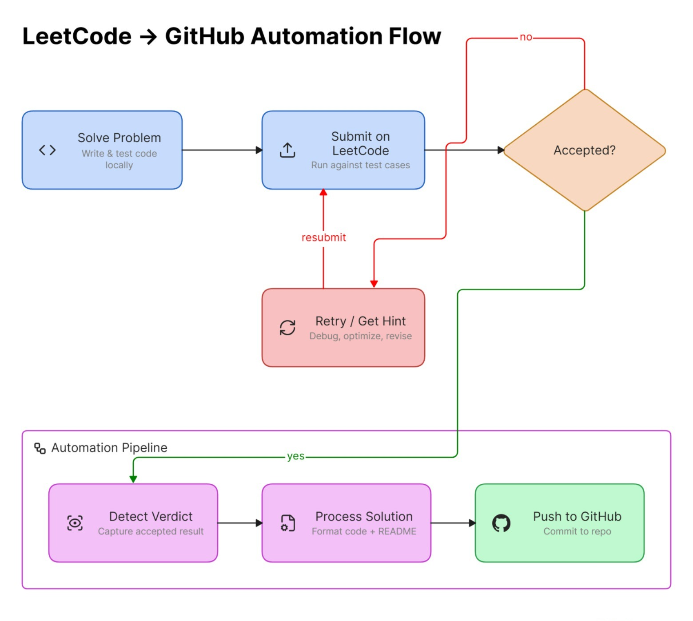
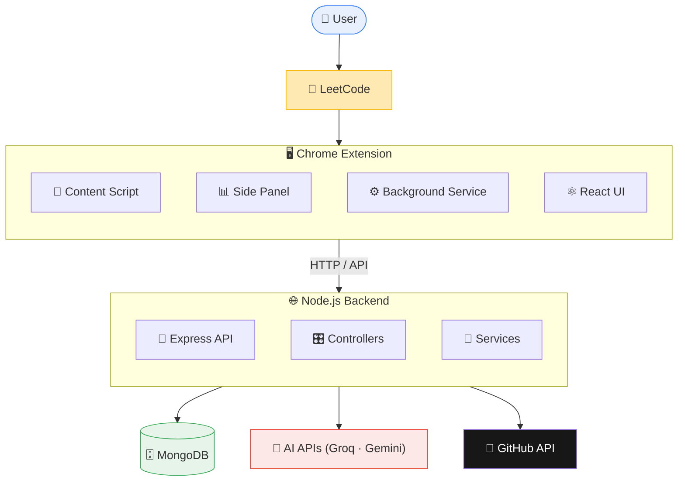

<div align="center">

# 🚀 Solvix

### Your AI-powered LeetCode companion

**Practice smarter. Get unstuck faster. Track your progress.    Sync your solutions.**

[](https://solvix-rouge.vercel.app/)
[](https://chromewebstore.google.com/detail/solvix/hclcapmhleolhlomnncjekmollipipoi)
[](LICENSE.md)
[](https://console.groq.com/)
[](#-tech-stack)

<p>
  <a href="https://solvix.hemant28.me/"><b>🌐 Website</b></a> ·
  <a href="https://github.com/mangalam-srv/Solvix"><b>💻 GitHub</b></a> ·
  <a href="landing-page/docs/DOCUMENTATION.md"><b>📖 Documentation</b></a> ·
  <a href="https://leetcode.com/"><b>🧑‍💻 LeetCode</b></a>
</p>

</div>

---

## 💡 What is Solvix?

**Solvix** is an AI-powered Chrome Extension that makes LeetCode practice structured, productive, and measurable.

Developers normally juggle LeetCode, problem sheets, AI assistants, analytics tools, external resources, and GitHub — all in separate tabs. **Solvix merges all of that into one experience, right next to your LeetCode editor.**

<div align="center">

| 🤖 AI Help | 📚 Structured Sheets | 📊 Progress Tracking | 🐙 GitHub Sync | 📧 Reports |
|:---:|:---:|:---:|:---:|:---:|
| Hints, bugs, solutions | Blind 75, NeetCode 150+ | Streaks & analytics | Auto-push accepted code | Daily/weekly digests |

</div>

---

## ✨ Features

### 🤖 AI Coding Assistant
Get contextual help without ever leaving LeetCode:

- 💡 Incremental hints  
- 📖 Problem explanations  
- 🐛 Bug detection  
- ⚡ Code optimization  
- 🧠 Algorithm walkthroughs  
- 💻 Complete solutions  
- 🔍 Alternative approaches  

The AI workspace uses the current problem statement, your code, and conversation context to give sharper, more relevant help. Powered by **Groq** and **Google Gemini**.

### 📚 Structured DSA Practice
Practice via popular roadmaps, without a separate spreadsheet or Notion doc:

- **Blind 75**
- **NeetCode 150**
- **Love Babbar 450**
- **Striver SDE**
- **Striver A2Z**

### 📊 Submission & Progress Tracking
Automatically tracked, always up to date:

`Verdicts` · `Attempts` · `Time spent` · `Problems solved` · `Streaks` · `Difficulty mix` · `Topic coverage` · `Languages used` · `Consistency`

### 📈 Interview Readiness & Analytics
Beyond a solved-problem counter — know **what to practice next**:

- Topic-wise performance & weak areas  
- Difficulty distribution  
- Practice consistency & average attempts  
- Time-spent trends  
- Overall interview readiness score  

### 🐙 GitHub Solution Sync
Every accepted solution, automatically centralized — see the [flow](#-github-sync-flow) below.

### 🔎 Alternative Problem Resources
When a problem is locked or unavailable on LeetCode, Solvix can surface equivalents on:

`GeeksforGeeks` · `Codeforces` · `HackerRank` · `CodeChef`

### 📧 Progress Reports & Reminders
Daily progress · Weekly summaries · Monthly reports · Topic breakdowns · Streak alerts

---

## 🔄 GitHub Sync Flow



Solvix automatically detects an accepted verdict, processes the solution, and pushes it straight to your GitHub repo — no manual copy-pasting after every problem.

---

## 🏗️ Architecture



👉 For the full internal application flow, see the **[Technical Documentation](landing-page/docs/DOCUMENTATION.md)**.

---

## 🛠️ Tech Stack

<table>
<tr>
<td valign="top" width="25%">

**🧩 Chrome Extension**
- Plasmo
- React
- TypeScript
- Tailwind CSS
- Chrome Extension APIs
- Monaco Editor

</td>
<td valign="top" width="25%">

**⚙️ Backend**
- Node.js
- Express.js
- Mongoose

</td>
<td valign="top" width="25%">

**🗄️ Database**
- MongoDB

**🤖 AI**
- Google Gemini
- Groq

</td>
<td valign="top" width="25%">

**🔌 Integrations**
- GitHub API
- LeetCode
- Nodemailer
- QuickChart
- node-cron

</td>
</tr>
</table>

---

## 🚀 Getting Started

### 👤 For Users

1. Visit **[solvix.hemant28.me](https://solvix.hemant28.me/)**
2. Install the Chrome Extension
3. Log in to LeetCode
4. Open the Solvix side panel
5. Configure your AI provider/API key (if required)
6. Open a problem → **start practicing** 🎯

### 🤖 Configure Groq AI

| Step | Action |
|:---:|---|
| 1 | Visit the [Groq Console](https://console.groq.com/) |
| 2 | Sign in or create an account |
| 3 | Open **API Keys** |
| 4 | Create a new API key |
| 5 | Copy the generated key |
| 6 | Open the Solvix Side Panel → AI/API settings → paste key |

> ⚠️ **Never commit your API key to GitHub or share it publicly.** Usage is subject to Groq's current API limits and policies.

---

## 🧑‍💻 Developer Setup

### Requirements
`Node.js` · `npm` · `MongoDB` · `Git` · `Groq/Gemini API credentials` · `GitHub OAuth credentials`

### Clone the Repository
```bash
git clone https://github.com/mangalam-srv/Solvix.git
cd Solvix
```

### Backend
```bash
cd Backend
npm install
npm run dev
```

Create a `.env` file inside `Backend/`:
```env
PORT=4000
MONGO_URI=your_mongodb_connection_string

GEMINI_API_KEY=your_gemini_api_key
GROQ_API_KEY=your_groq_api_key

EMAIL_USER=your_email
EMAIL_PASS=your_email_password

GITHUB_CLIENT_ID=your_github_client_id
GITHUB_CLIENT_SECRET=your_github_client_secret
```
> Never commit `.env` files or credentials to the repository.

### Chrome Extension
```bash
cd track-it
npm install
npm run dev
```

Then open `chrome://extensions/` → enable **Developer mode** → **Load unpacked** → select:
```text
track-it/build/chrome-mv3-dev
```
Open LeetCode and launch the Solvix side panel. ✅

---

## 📖 Documentation

Full technical docs cover architecture, folder structure, file-by-file and function-by-function explanations, data flow, API reference, database models, AI integration, auth & security, and a beginner learning roadmap.

👉 **[Read the Complete Documentation](landing-page/docs/DOCUMENTATION.md)**

---

## 🤝 Contributing

```bash
git checkout -b feature/your-feature
```

Make your changes, test locally, and open a Pull Request. For larger changes, please open an issue first to discuss the approach.

## 🐛 Found a Bug?

Open a GitHub Issue with:
- A clear description
- Steps to reproduce
- Expected vs. actual behavior
- Screenshots/logs when applicable

## 🔐 Security

**Never commit:** API keys · OAuth secrets · DB credentials · Email passwords · Access tokens · `.env` files

If you discover a vulnerability, please avoid posting sensitive details publicly — contact the maintainers privately instead.

## 📌 Roadmap

- [ ] More DSA problem sheets
- [ ] More AI providers
- [ ] Enhanced performance analytics
- [ ] More GitHub customization
- [ ] Improved recommendation engine
- [ ] Additional coding platforms
- [ ] More personalized practice plans

## 🔗 Links

| Resource | Link |
|---|---|
| 🌐 Website | https://solvix-rouge.vercel.app/ |
| 💻 GitHub | https://github.com/mangalam-srv/Solvix |
| 📖 Documentation | [docs/DOCUMENTATION.md](landing-page/docs/DOCUMENTATION.md) |
| 🤖 Groq | https://console.groq.com/ |
| 🧑‍💻 LeetCode | https://leetcode.com/ |

## 📄 License

Solvix is licensed under the **MIT License** — see [LICENSE](LICENSE.md) for details.

## 👥 Authors

Built by [**Hemant**](https://github.com/hemant2807) and [**Mangalam**](https://github.com/mangalam-srv)

---

<div align="center">

### 🚀 Solvix
**Practice smarter. Solve better. Build consistently.**

Made with ❤️ for developers preparing for technical interviews.

</div>